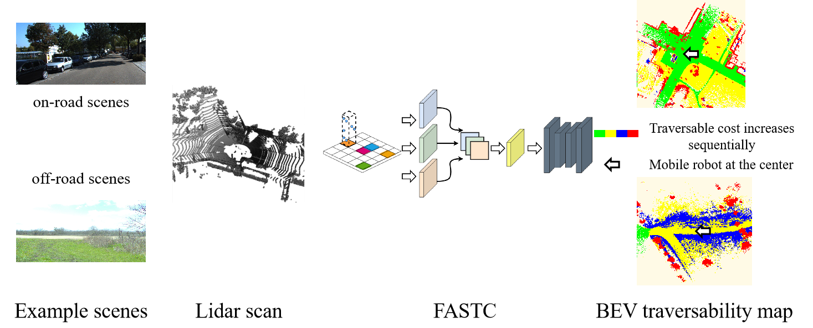
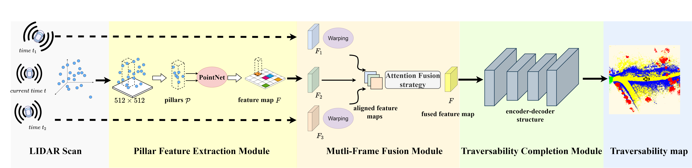

# FASTC

Code repository for “FASTC: A Fast Attentional Framework for Semantic Traversability Classification Using Point Cloud”.  ECAI 2023.
[Paper link](https://www.researchgate.net/publication/374308462_FASTC_A_Fast_Attentional_Framework_for_Semantic_Traversability_Classification_Using_Point_Cloud)



## Abstract

Producing traversability maps and understanding the surroundings are crucial prerequisites for autonomous navigation. In this paper, we address the problem of traversability assessment using point clouds. We propose a novel pillar feature extraction module that utilizes PointNet to capture features from point clouds organized in vertical volume and a 2D encoder-decoder structure to conduct traversability classification instead of the widely used 3D convolutions. This results in less computational cost while even better performance is achieved at the same time. We then propose a new spatio-temporal attention module to fuse multi-frame information,which can properly handle the varying density problem of LIDAR point clouds, and this makes our module able to assess distant areas more accurately. Comprehensive experimental results on augmented Semantic KITTI and RELLIS-3D datasets show that our method is able to achieve superior performance over existing approaches both quantitatively and quantitatively.



### Dependencies

```
PyTorch
yaml
numpy
scipy
ipdb
opencv
tqdm
spconv
argparse
numba
```

## Datasets


SemanticKITTI and RELLIS-3D: Follow the instructions in [semantic_bevnet/generate_bev_gt](https://github.com/JHLee0513/semantic_bevnet/tree/corl-cleaned/generate_bev_gt)

## Training

**FASTC-S** 

```
cd experiments
bash train_single.sh /path/to/your/model/config
```


 Please replace `/path/to/your/model/config` with the path to your model file, for example, `experiments/kitti4_100/single/include_unknown`.  Please modify the paths in the bash file as follows: replace `../dataset_configs/your_yaml` with the path to your YAML configuration file, for example, `../dataset_configs/kitti.yaml`. Similarly, replace `/path/to/dataset` with the path to your dataset, for example, `datasets/kitti`. Logs and model weights will be stored in a subdirectory of the config file like this: `experiments/kitti4_100/single/include_unknown/default--logs/`

**FASTC-F**

```
cd experiments
bash train_fusion.sh /path/to/your/model/config
```

Logs and model weights will be stored in a subdirectory of the config file `experiments/kitti4_100/recurrent/include_unknown/default--logs/`.

## inference

```
cd /path/to/FATSC/FASTC
python test_single.py --model_file /path/to/model --test_env kitti4
```

## TODOs

\- [x] Source code upload

\- [ ] Clean up the code

\- [x] Instructions on training and inference

## Acknowledgements

Our code is heavily based on the following public repositories, thanks for the excellent works:

- [BEVNet](https://github.com/JHLee0513/semantic_bevnet)
- [RegSeg](https://github.com/RolandGao/RegSeg)

## Citation

If you find our work useful in your research please consider citing our paper:


```bibtex
@incollection{chen2023fastc,
 title={FASTC: A Fast Attentional Framework for Semantic Traversability Classification Using Point Cloud},
 author={Chen, Yirui and Wei, Pengjin and Liu, Zhenhuan and Wang, Bingchao and Yang, Jie and Liu, Wei},
 booktitle={ECAI 2023},
 pages={429--436},
 year={2023},
 publisher={IOS Press}
}
```
